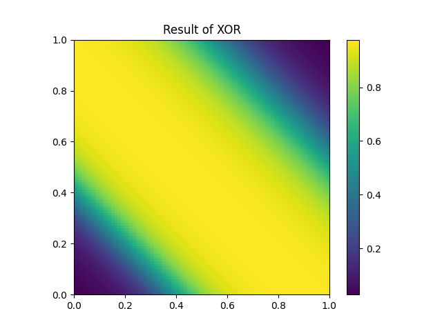
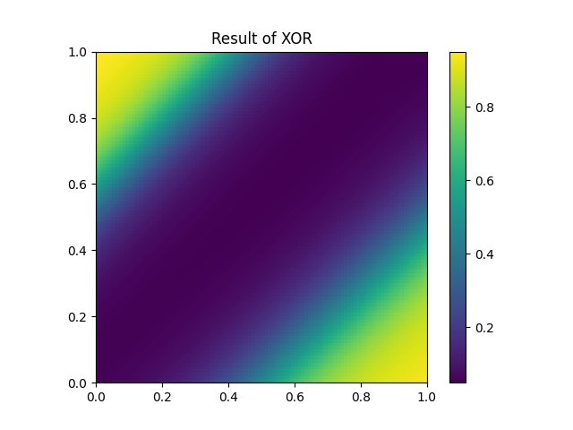

# Argumented Topology Neural Network (Node-wise NN)
This is an implementation of my research on Argumented Topology Neural Network (Node-wise NN).


## Suggested Set Up

Create environment
```
python3 -m venv env
source env/bin/activate
```

Install required libs
```
pip install -r requirements.txt
```

## Examples
I have provided some examples in the `examples` folder. You can run them by executing each file.


### Example sample: 
#### XOR solver:
epoch=10000, learning rate = 0.1 (fixed), with 2-4-1 topology



epoch=10000, learning rate = 0.1 (fixed), with 2-2-1 topology



## Current Goals:
- [ ] Implement effective persistence (save/load) for neural network
- [ ] Implement genetic exploration for topology optimization
- [ ] Implement recurrence neural links
- [ ] Implement digit recognition example
- [ ] (stretch goal) Implement iterative version for forwarding and backpropagation (more controllable and better for future optimization)
